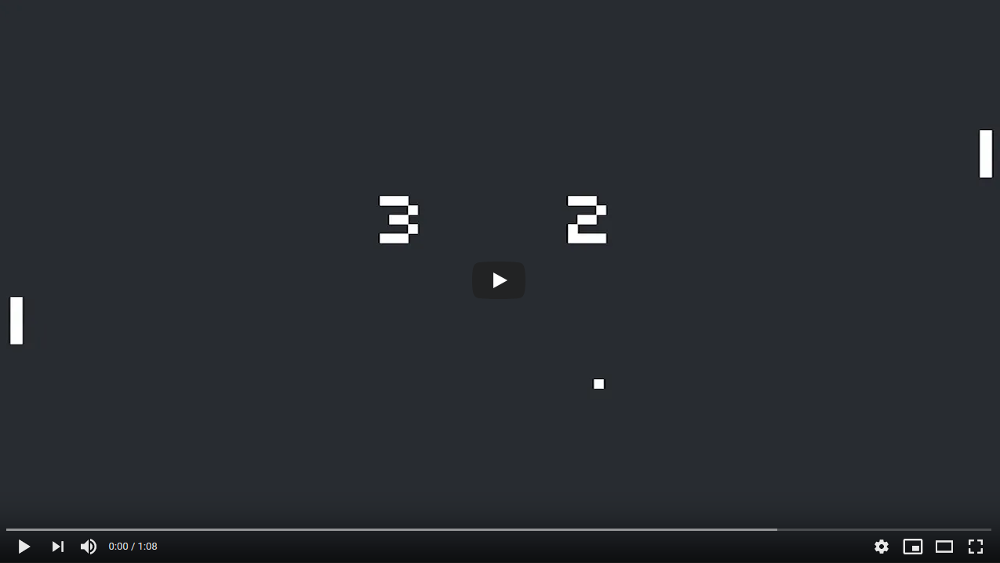

# Assignment 0 - Pong 🏓

- 💯**Worth**: 2.5%
- 📅**Due**: August 29, 2021 @ 23:59
- 🙅🏽‍**Penalty**: Late submissions lose 10% per day to a maximum of 3 days. Nothing is accepted after 3 days and a grade of 0% will be given.

## 🎯 Objectives

- Read and understand all of the Pong source code from Lecture 0.
- Implement a basic AI for either Player 1 or 2.

## 🎥 Demo

## 🔍 Context

Your first assignment in the course will be a fairly easy one, since the dive into game development can be deep enough as it is without having to implement an entire code base from scratch! Instead, we'll take the Pong example we learned in class and extend it in a small but fun way by giving one of the paddles logic for playing the game so that you don't always need a buddy to play the game with you! We'll approach problem sets in the course this way generally, taking the full code bases we've used in lecture and extending them so that you'll get plenty of experience exploring fully implemented games. You can even use these projects as templates for your own games!

Once you've cloned the repo, the actual change you'll be making to the code base is small, but it will require you to understand what many of the pieces do, so be sure to [review the lecture notes](https://jac-cs-game-programming-f21.github.io/Notes/#/0-Pong) read through the code so you have a firm understanding of how it works before diving in! In particular, take note of how paddle movement works, reading both the `Paddle` class as well as the code in `main.js` that actually drives the movement, located in the `update()` function (currently done using keyboard input for each). If our agent's goal is just to deflect the ball back toward the player, what needs to drive its movement?

Implement an AI-controlled paddle (either the left or the right will do) such that it will try to hit the ball at all times. Since the paddle can move on only one axis (the Y axis), you will need to determine how to keep the paddle moving in relation to the ball. Currently, each paddle has its own chunk of code where input is detected by the keyboard; this feels like an excellent place to put the code we need. Once either the left or right paddle tries to hit the ball on their own, you've done it!

## 🌿 Git

Just like in Web II, we will be using GitHub and Gradescope. You can use either the Git CLI or you can also use VSC's built-in Git GUI client.

### 🖱️ GUI

1. In VSC, click on the third icon down in the left navigation bar to see a list of files that have changed and are ready to be staged.
2. Hover over where it says _Changes_ (right below the commit textbox) and click `+` to stage all the modified files to be committed. Alternatively, you can add specific files by clicking the `+` next to the individual file.
3. Type a commit message into the textbox and click the checkmark above it to commit all the files that were just staged.
4. Click `...` and then `push` to push the commit(s) up to GitHub.

### ⌨️ CLI

1. Run `git status` to see a list of files that have changed and are ready to be staged.
2. Run `git add .` to stage all the modified files to be committed. Alternatively, you can add specific files like this: `git add src/Paddle.js`.
3. Run `git commit -m "A descriptive message here."` (including the quotes) to commit all the files that were just staged.
4. Run `git push` to push the commit(s) up to GitHub.

Regardless of the method you choose, it is very important that you commit frequently because:

- If you end up breaking your code, it is easy to revert back to a previous commit and start over.
- It provides a useful log of your work so that you (and your teammates if/when you're on a team) can keep track of the work that was done.

## 📥 Submission

Once you've made your final `git push` to GitHub, here's what you have to do to submit:

1. Go to [Gradescope](https://www.gradescope.ca/courses/4779) and click the link for this assignment.
2. Select the correct repository and branch from the dropdown menus.
3. Click _Upload_.
